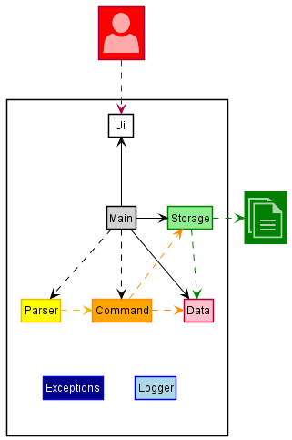
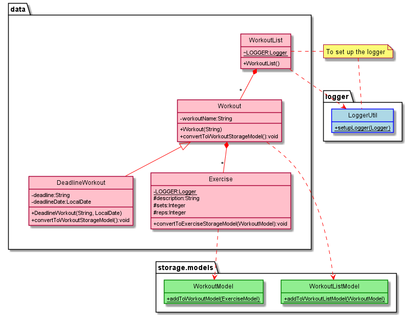

# Developer Guide

- [Acknowledgements](#acknowledgements)
- [Design & Implementation](#design--implementation)
  - [Data Component](#data-component)
  - [Storage Component](#storage-component)
- [Product Scope](#product-scope)
  - [Target User Profile](#target-user-profile)
  - [Value Proposition](#value-proposition)
- [User Stories](#user-stories)
- [Non-Functional Requirements](#non-functional-requirements)
- [Glossary](#glossary)
- [Instructions for manual testing](#instructions-for-manual-testing)

## Acknowledgements

- Libraries used: [Jackson](https://github.com/FasterXML/jackson), [JUnit5](https://github.com/junit-team/junit5)

## Design & implementation

### Basic Architecture

__Note:__
* `GetJackd` : Main of whole application.
* `Ui` : In charge of reading user input and printing the results on the terminal.
* `WorkoutList` : Contains list of all workouts the user has added.
* `Storage` : In charge of storing and loading user data.
* `CommandManager` : Parses user input and returns Command object.
* `Command` : Holds all information related to a type of command and can be executed.
* `LoggerUtil` : Contains method to set up the logger for each class.

Basic sequence of events:
1. User inputs data which is read by `Ui` inside `GetJackd`
2. `GetJackd` makes a new `CommandManager` Object
3. The user input is passed into `CommandManager` which parses it to return a `Command`
4. The `Command` object is executed.
5. `Ui` acknowledges the command and shows the result of the Command if any.

### Data Component

Location : `seedu.duke.data`

__Note:__
* `WorkoutList` : List of all Workout Routines.
* `Workout` : A specific Workout Routine eg. "Leg day" could be a routine created for exercises that focus on legs.
* `Exercise` : A specific exercise eg. "Squats" could be an exercise added to "Leg day." 

The `data` component defines the format in which data is temporarily stored while the application is running.
As seen in the figure above, the highest level of abstraction is the `WorkoutList` which stores all the workout routines
that the user has currently stored. Next, the `Workout` refers to a Workout Routine and stores a variable number of 
exercises (in the form of an `Exercise` object). Lastly, `Exercise` stores the exercise with attributes:
* `description` corresponding to the name of the exercise.
* `reps` corresponding to the number of times the exercise is done in a given set.
* `sets` corresponding to the number of times the whole exercise is repeated.

__Storage.models__: `addToWorkoutListModel(WorkoutModel workout)` and `addToWorkoutModel(ExerciseModel exercise)` from the `storage.models` component
are called in the methods of `Workout` and `Exercise` respectively. This causes the dependency on `WorkoutModel` and `WorkoutListModel` as seen in the UML Diagram.

### Storage Component

Location: `seedu.duke.storage`

__Note:__
* `Storage` : Deals with loading tasks from the json file and saving tasks in the json file.
* `JsonUtil` : Handles functions required to convert Java Objects to JSON objects and vice versa using the Jackson Library.

The `Storage` component,
- can save workout list data in json format, and read them back into corresponding Java objects.
- depends on some classes in the `Models` component within Storage (because the Storage component can only save/retrieve objects that belong to the Model).

## Product scope
### Target user profile

- has a need to plan and remember their workouts quickly
- Prefer desktop apps over other types
- Can type fast
- Comfortable using CLI apps

### Value proposition: 
Manage fitness routines quickly

## User Stories

|Version| As a ... | I want to ... | So that I can ...|
|--------|----------|---------------|------------------|
|v1.0|new user|see usage instructions|refer to them when I forget how to use the application|
|v1.0|fit user|create my own workouts|follow the workouts that I created|
|v1.0|over-ambitious user|delete my workouts|remove really hard workouts that I thought I could do but realised I couldn't|
|v2.0|busy user|enter into workouts|add exercises without the workout index parameter and save time|
|v2.0|unfit user|be suggested workouts|so that I can follow them to achieve basic fitness|
|v2.0|forgetful user| be constantly reminded of the syntax for commands|so that I can easily correct any incorrect input while using the app|

## Non-Functional Requirements

* Able to store data in a file so that user data can be saved.

## Glossary

* *glossary item* - Definition

## Instructions for manual testing

{Give instructions on how to do a manual product testing e.g., how to load sample data to be used for testing}
